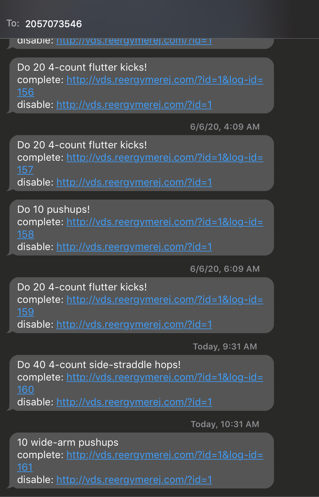
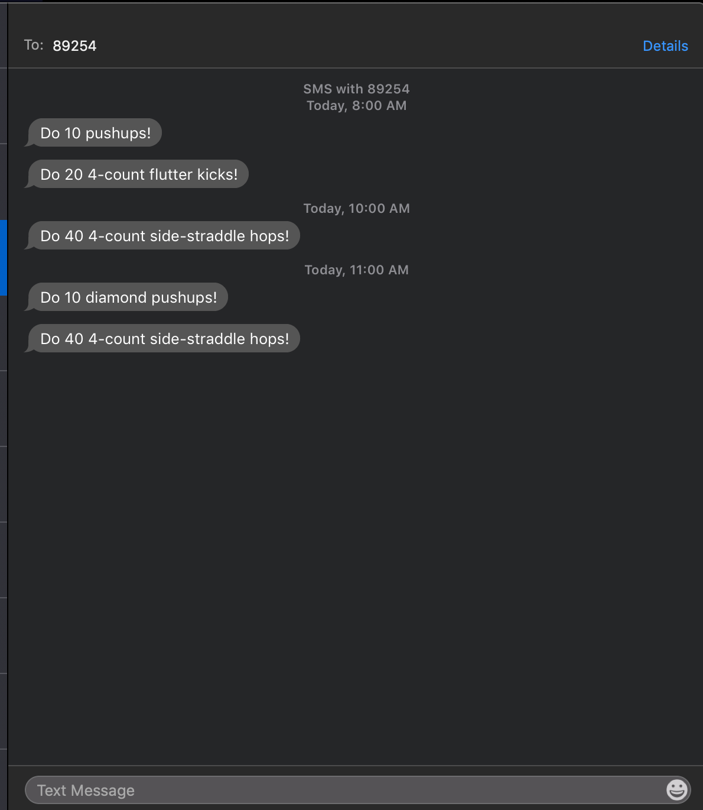
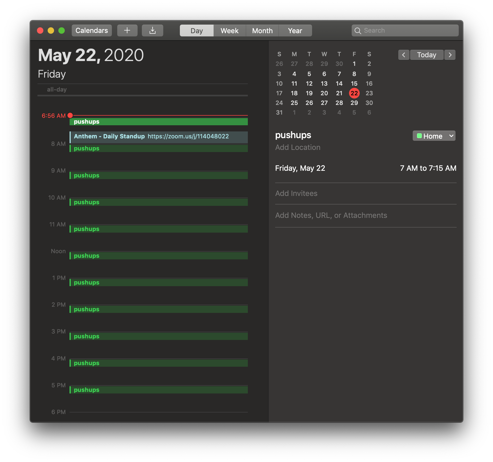

# Next

To provide more control to users, we are providing a method to disable commands
without contacting support.

1. send curl with id
  Start here to ensure the implementation does not dictate the interface.

  curl -X PUT 'https://cmsvl04jha.execute-api.us-east-1.amazonaws.com/prod/VirtualDrillSergeant/commands/disable/command_log_id'

1. requires a Gateway API endpoint
  Mock at first to ensure we can hit it from the client.

1. requires Lambda
  Connect the dots, refining inputs/outputs


# 4.0.2

To improve the disable command flow:
* Users will be _empowered_ to gather some of the information themselves.  This
    will reduce the feeling of helplessness.
* Queries will be modified to accept data from the users to make the update
    process _faster_ once support is involved.

  ```sql
  UPDATE commands
  SET disabled = FALSE
  WHERE id IN (
    SELECT command_id
    FROM command_log
    WHERE command_log.id = 184
  )
  RETURNING id, text, disabled
  ;
  ```

# 4.0.1


* Include links in message to open web app and mark complete

## Use Case
I hurt my leg, so I want to disable the jumping jacks command for a little
while.

### MVP

Call support. Support can find the command and turn it on/off.  Disabled
commands will not be included in future commands sent to the user.

    ```sql
    UPDATE commands
    SET disabled = TRUE
    WHERE id = 9
    RETURNING text, disabled
    ;
    ```
If all commands are disabled, you will receive no messages.





# 4.0.0

* Provide log of commands
* Indicate in client which commands were completed
* Segment into two different groups


# 3.2.0

## Changed

* Check status in web client automatically before/after changes


## Added

* Record issued commands


# 3.1.0

## Added

* Status check on web client to see if the drill sergeant is on or off
* A couple new commands

## Changed

* Reorganized src
* Changed to send_message lambda
* Pulling number and commands from DB


# Version 3.0.0


Turn on/off with my phone.
For this, we need Lambda functions to toggle the enabled rule.
We need API Gateway to hit the toggle functions.


## Enable
curl -i -X PUT 'https://cmsvl04jha.execute-api.us-east-1.amazonaws.com/prod/VirtualDrillSergeant/enable'

## Disable
curl -i -X PUT 'https://cmsvl04jha.execute-api.us-east-1.amazonaws.com/prod/VirtualDrillSergeant/disable'


# Version 2.0.0

The Python code has been added to a Lambda function.  This function can be
triggered by a Cloud Watch event on a schedule (once an hour).  This means we
can turn it on/off and not worry about keeping my computer on.

```sh
# enable
aws events enable-rule --name CW_rule_cron_job
# disable
aws events enable-rule --name CW_rule_cron_job
```


# Version 1.2.0

## Added

* Variety to commands
* Better setup tools for Python




# Version 1.1.0

## Added

* Send messages via SMS.


Create a cron job to send the message every hour.

```sh
crontab -e
# Send message at the top of every hour
0 * * * * /usr/local/bin/python3 ~/Desktop/drillseargeant/src/send_message/send_message.py
 ```

## Desired Features

* Variety in commands to make it more interesting.
* Record of commands executed

# Version 1.0.0

Add reminders to the calendar.  That's not so bad really.



Desired Feature: Send reminder as SMS instead of having it on the calendar.
