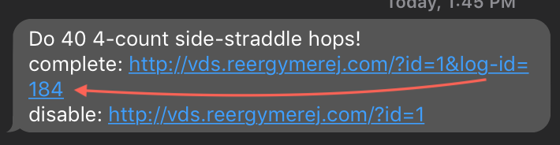

# Virtual Drill Sergeant

Wouldn't it be cool if a DS could text you throughout the day to help you stay
in shape?

## User Manual

To disable commands that may be issued, locate the "command_log_id" and contact
support.  You're not a real user, so I don't need to tell you how to do that.
Just text me.

To find your "command_log_id,"

### From a Message

Look for the "log-id" part of the url.

## Wishlist

* Control over which commands are issued
  select screen to decide on exercises I'd like to see that I can change at any
  time

* More flexibility over scheduling (ex: every 30 minutes after 6 pm)

* Hierarchy or categorization of commands
  exercise type and severity

* Use shortened urls in text messages.
* Make it easier to mark a command as completed.
  text back a word to mark complete
* segment log by days
* share db across lambda functions to run locally
* Use CloudFormation to create a stack for this.  This will help me learn AWS
    and possibly allow for whitelabeling this idea.
